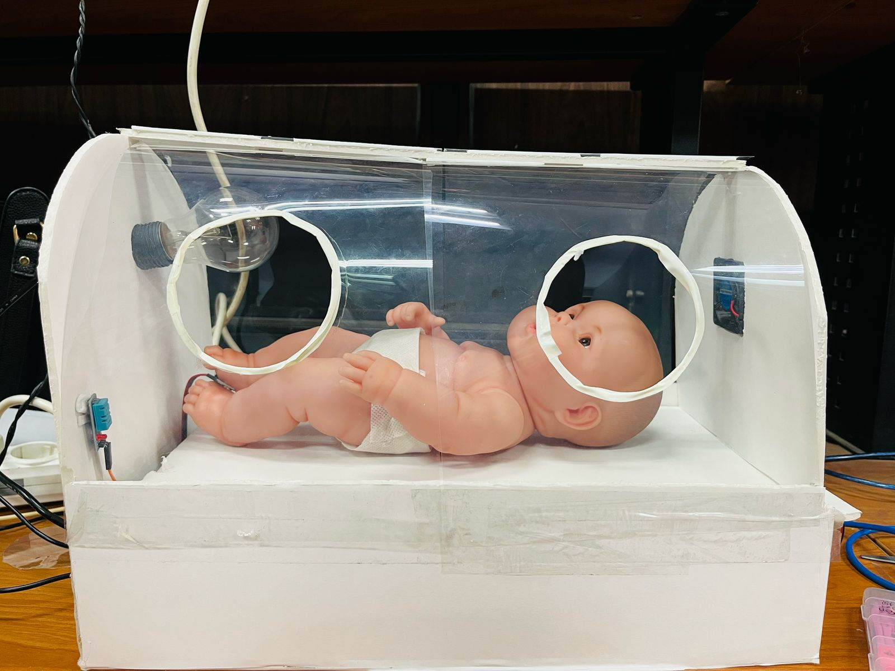

# Infant Incubator Monitoring System

## Overview
This project is an Infant Incubator Monitoring System that measures and regulates temperature, humidity, and heart rate using an Arduino-based system. It features an LCD display, a temperature/humidity sensor (DHT11), a Pulse Sensor, a 12v fan and an AC lamp system for heating and cooling, and a buzzer for alerts.

## Features
- **Temperature and Humidity Monitoring**: Uses a DHT11 sensor to measure environmental conditions.
- **Heart Rate Monitoring**: Uses a Pulse Sensor to track BPM (beats per minute).
- **LCD Display**: Shows real-time temperature, humidity, and BPM readings.
- **Automated Temperature Control**: Activates lamp and 12v fan to control heating and cooling based on temperature thresholds.
- **Buzzer Alerts**: Sounds an alarm if temperature goes beyond the safe range.

## Components
- **Arduino Board**
- **DHT11 Temperature & Humidity Sensor**
- **Pulse Sensor**
- **16x2 LCD Display**
- **Relay Module (for controlling heating/cooling elements)**
- **12vFan**
- **AC Lamp**
- **Buzzer**
- **Wires and Breadboard**

## Circuit Connections
- **DHT11 Sensor**:
  - VCC → 5V
  - GND → GND
  - Data → Pin 5

- **Pulse Sensor**:
  - Signal → A0

- **LCD Display (16x2)**:
  - RS → Pin 7
  - Enable → Pin 8
  - D4 → Pin 9
  - D5 → Pin 10
  - D6 → Pin 11
  - D7 → Pin 12

- **Relay Module**:
  - Fan Control → A5
  - Lamp Control → Pin 3

- **Buzzer**:
  - Signal → Pin 13

## Test Plan
  

https://github.com/user-attachments/assets/97831650-28da-4bbf-a033-6b71b6d8c13d

## Code Script Explanation
1. **Initialize Sensors & LCD**: Setup DHT11, Pulse Sensor, and LCD.
2. **Read BPM**: Detect heartbeats and display BPM.
3. **Read Temperature & Humidity**: Fetch values from DHT11.
4. **Control Relays**:
   - If **temperature > 30°C**, turn ON the cooling relay and buzzer.
   - If **temperature < 20°C**, turn ON the heating relay and buzzer.
5. **Display Data on LCD**: Show temperature, humidity, and BPM.
6. **Serial Output**: Print data for debugging.

## Future Improvements
- Add Wi-Fi/Bluetooth connectivity for remote monitoring.
- Implement data logging for long-term tracking.
- Improve UI with a larger display or touchscreen.

