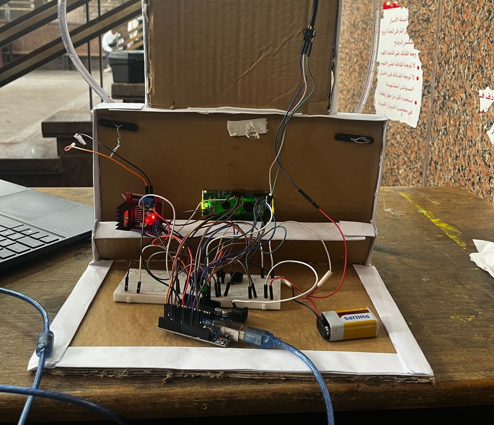

# Infusion Pump

## Overview
This project is an Arduino-based infusion pump system that precisely controls the flow of liquid using a flow sensor and adjusts the pump speed based on user input. The system includes an LCD for real-time display of flow rate and total volume, and a buzzer to indicate low flow conditions.

## Features
- Measures real-time flow rate in L/min
- Displays total infused volume in milliliters (mL)
- Adjustable infusion rate using a button
- Buzzer alert for low flow conditions
- Automatic pump shut-off when the set infusion volume is reached
- LCD display for real-time monitoring

## Components Used
- Arduino Uno
- Flow sensor (Hall effect type)
- 16x2 LCD display 
- Motor driver (L298N)
- Water pump
- Push button
- Buzzer

## Wiring Diagram
| Component  | Arduino Pin |
|------------|------------|
| Flow Sensor | D2         |
| LCD (RS, EN, D4, D5, D6, D7) | 12, 11, 5, 4, 3, 13 |
| Pump Motor (IN3, IN4, ENB) | 7, 6, 8 |
| Button | 9 |
| Buzzer | 10 |

## Video Demonstration for test plan

https://github.com/user-attachments/assets/d9f70a2c-7f92-4b73-a28d-6ca7b29527e5

## Usage
- Press the button to decrease the infusion rate to half the speed.
- The LCD will display the real-time flow rate and total infused volume.
- If the flow rate drops below 0.3 L/min, the buzzer will sound an alert.
- The pump will automatically stop when the desired infusion volume is reached.

## Future Improvements
- Add an OLED or TFT display for a better user interface.
- Implement wireless monitoring via Bluetooth or Wi-Fi.
- Integrate a mobile app for remote control and monitoring.
- Allow programmable infusion volumes and rates.

